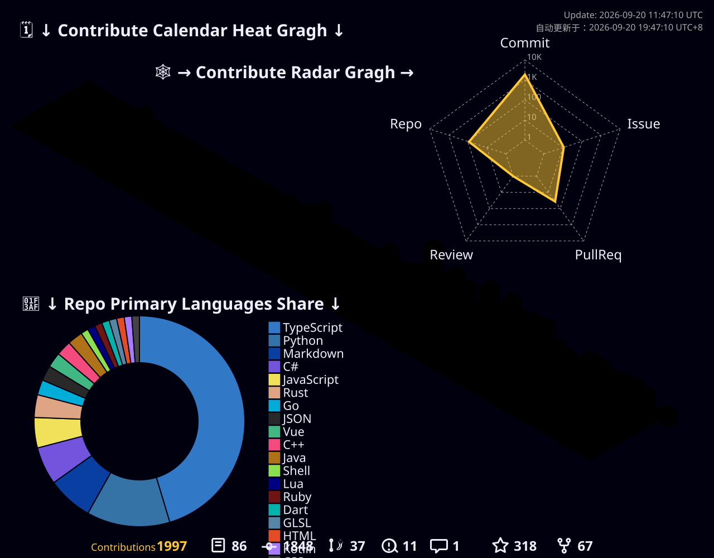

# 你好

  

---

## 📊 统计信息

> 🤖 本页面统计数据通过 GitHub Actions 自动更新，支持[定时任务、Push 触发、手动执行](../.github/workflows/update.md)三种方式。

<!-- GIT_STATS_START -->
### 📈 GitHub 统计

  

<!-- GIT_STATS_END -->

<!-- LINE_STATS_START -->
### 📏 不同语言的代码行数排行捏

  

<!-- LINE_STATS_END -->

<!-- BYTE_STATS_START -->
### 📊 不同语言的代码字节数占比捏

  

<!-- BYTE_STATS_END -->

### 🎨 3D GitHub 贡献图

  

### 🔥 提交统计

### 📊 仓库语言分布

  
  

### 📈 活动概览

